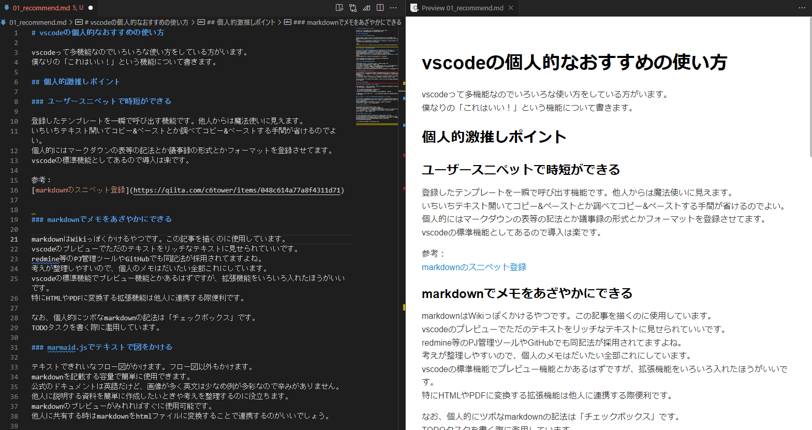
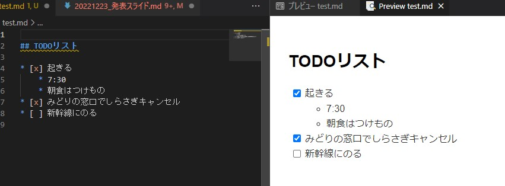
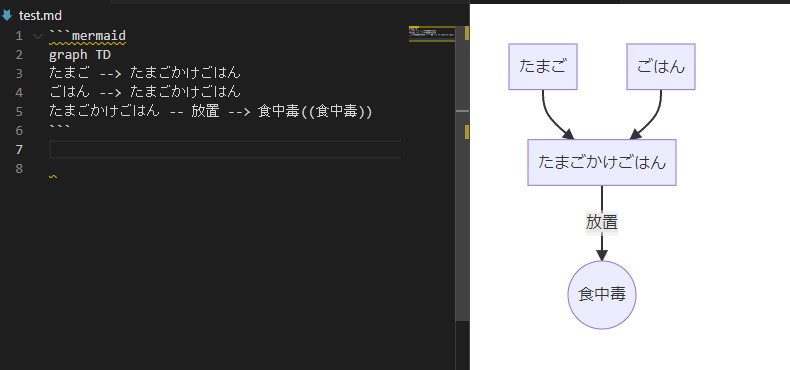
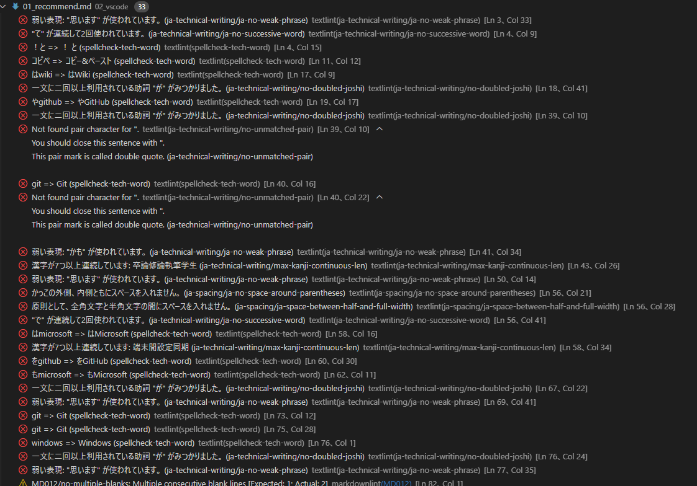
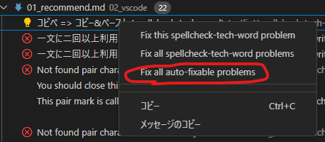
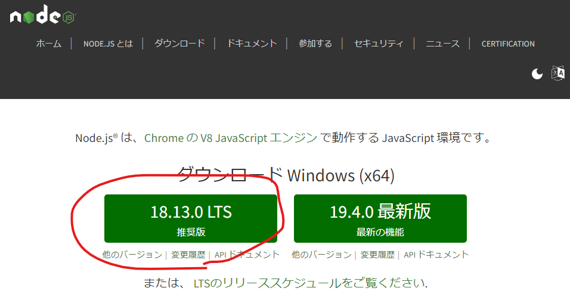
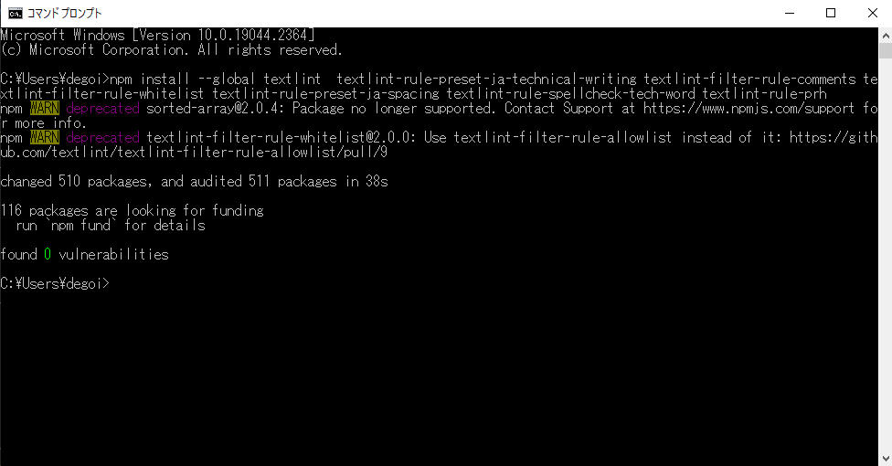
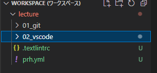
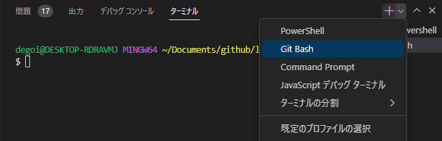

# vscodeの個人的なおすすめの使い方

vscodeって多機能なのでいろいろな使い方をしている方がいます。
僕なりの「これがいい！」という機能について書きます。

## 個人的激推しポイント

### ユーザースニペットで時短ができる

登録したテンプレートを一瞬で呼び出す機能です。他人からは魔法使いに見えます。
いちいちテキスト開いてコピー&ペーストとか調べてコピー&ペーストする手間が省けるのでよい。
個人的にはマークダウンの表等の記法とか議事録の形式とかフォーマットを登録させてます。
vscodeの標準機能としてあるので導入は楽です。

参考：
[markdownのスニペット登録](https://qiita.com/c6tower/items/048c614a77a8f4311d71)

### markdownでメモをあざやかにできる

markdownはWikiっぽくかけるやつです。この記事を描くのに使用しています。
vscodeのプレビューでただのテキストをリッチなテキストに見せられていいです。


redmine等のPJ管理ツールやGitHubでも同記法が採用されてますよね。
考えが整理しやすいので、個人のメモはだいたい全部これにしています。
vscodeの標準機能でプレビュー機能とかあるはずですが、拡張機能をいろいろ入れたほうがいいです。
特にHTMLやPDFに変換する拡張機能は他人に連携する際便利です。

なお、個人的にツボなmarkdownの記法は「チェックボックス」です。
TODOタスクを書く際に濫用しています。
プレビュー画面からチェックボックスを推せるのが地味にいいです。



### marmaid.jsでテキストで図をかける

テキストできれいなフロー図がかけます。フロー図以外もかけます。



markdownを記載する容量で簡単に使用できます。
公式のドキュメントは英語だけど、画像が多く英文は少なめ例が多彩なので辛みがありません。
他人に説明する資料を簡単に作成したいときや考えを整理するのに役立ちます。
他人に共有する時はmarkdownをhtmlファイルに変換することで連携するのがいいでしょう。
導入として拡張機能を入れる必要があります。
`Markdown Preview Mermaid Support`を入れる記事が多いけど、`Markdown Preview Enhanced`だけでいいです。

参考：
[mermaid.jsをMarkdownファイル内部に記載しよう](https://anteku.jp/blog/develop/mermaid-js%E3%82%92markdown%E3%83%95%E3%82%A1%E3%82%A4%E3%83%AB%E5%86%85%E9%83%A8%E3%81%AB%E8%A8%98%E8%BC%89%E3%81%97%E3%82%88%E3%81%86/)

### 自動文章校正で労働から開放される

てにをはや表記ゆれを自動でチェックできます。文章校正は人間がやる仕事ではありません。
指摘内容も「`が`が複数あって主語わかりづらいよ」のように指摘してくれて文章の読みやすさアゲアゲです。
試しに、本記事の草案を文章校正した時の結果が以下です。すごい。



機械的に直せるものは自動で修正もできます。



また、表記ゆれのパターン（「`あったほうがいい`→`あるとよい`」みたいな）は自分でも登録できるのもいいです。
ネットに長文を投稿する方、議事録をよく書かれる方、卒論修論の執筆学生など文章を書く人におすすめです。

導入にはNode.jsを入れる必要があり、手順もあるのでちょっと大変かもしれません。
参考に自己流の入れ方について以下に記載してみました。参考にしてみてください。

#### 自己流のやり方(Windows)

1. Node.jsのLTSをインストール [こちら](https://nodejs.org/ja/)
    

1. cmdで以下のコマンドをたたく

    ```cmd
    npm install --global textlint  textlint-rule-preset-ja-technical-writing textlint-filter-rule-comments textlint-filter-rule-whitelist textlint-rule-preset-ja-spacing textlint-rule-spellcheck-tech-word textlint-rule-prh
    ```

    こんな感じになる（はず）
    

1. vscodeにフォルダを読み込ませ、フォルダの直下に`.textlintrc`と`prh.yml`を作成
    * このlectureにもpushしているのでそれを参考に入れちゃっていいです。
    * 検索していろいろカスタマイズするといいと思います。

    

1. vscode再起動

1. 同フォルダに以下の内容のテキストファイルを作成して保存してみる。

    ```text
    あんこがほしい。
    あんこがほしいです。
    ドーピングすることができます。
    これはぺんです
    あんこん。
    ```

1. 画面の下の「問題」タブに指摘があればOKです。
    * 3行目の表現が冗長、４行目に読点がないと指摘されればOK!

## その他の推しポイント

<!--
### いろいろなプログラミング言語に対応できる

ここに書かなくても多分大多数の人はいれているプログラミング系の各種拡張機能のことです。
だいたい以下のパターンかと思います。

* コードの静的チェックしていくれるやつ（lint）
* コードをカラフルにするやつ（xxxxxxx）
* サーバー立てるやつ（サーバーがないと動作チェックできない言語向け）

とりあえず、「（使いたいプログラム言語）vscode拡張機能」みたいな検索にある拡張機能を入れましょう。
-->

### 端末間で設定同期できる

ユーザースニペットやインストールした拡張機能、個人の設定等を設定同期できます。
それによって、メインPCとサブのPCで設定同期ができたり、新しいPCに同様の設定をする手間がなくなるので楽です。
GitHubがなくてもMicrosoftのアカウントもあればそれで連携も可能です。
vscodeの標準機能であるため、導入は簡単です。

参考：
[Visual Studio Code公式の設定同期「Settings Sync」を利用する](https://qiita.com/Nuits/items/6204a6b0576b7a4e37ea)

<!--
### vscodeでスライドが作れる

markdownでスライドをかける拡張機能があります。
テキストベースでスライドゴリゴリかけるのがいいです。
そのままスライドとして使ってもいいし、スライドの草案を作成するのにも向いています。
ただ、個人的にはそもそもスライド作成する機会がないので使用頻度は低です。
拡張機能を入れるだけで使用できます。
-->

### vscodeでGit bushがたたける

vscodeの画面の下のコマンドプロンプト打てる場所でGit bushが使えます。


つまり、Windowsでlinuxのコマンドが使えて便利です。CMDのコマンド使いづらいもん。
特に、vscodeのデフォルトのテキストの文字コードはUTF-8なのでその点も親和性が高いです。
grepとかcatとか使いまくって大量テキスト処理マンになっています。
（vscodeと関係ないのでは…？）

使用するにはGit bushをいれる必要があります。

### 矩形選択(Ctrl+Shift+Alt+矢印)

テキストエディタではよくある（？）矩形選択が当然のようにできるのがいいです。
いろいろショートカットはある中で、一番使用しました。
むしろこれ以外はしらないまである。
