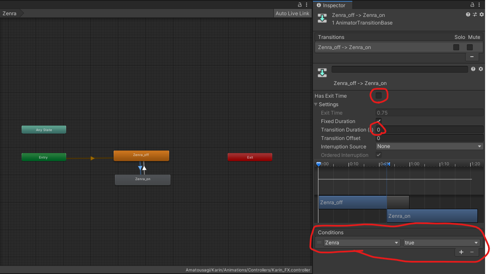

# VRC上でアバターの服を脱がすギミックの実装手順

## 改定履歴

* 2023/11/05 初版
* 2023/11/06 一部記載が異なるProjectの者になっていたのを修正

## 背景

VRCの「風呂のあるお部屋 YUTOROOM -ゆとるーむ‐」は素晴らしいお風呂ワールドです。
フレンドと裸でこそ盛り上がる話もあるでしょう（？
とはいえ、通常裸になれるようにアバターはセットアップされていないことがほとんどです。
アバターをUnityで裸にムキムキして上げるのもいいですが、うっかりpublicでそのアバターにチェンジして事故る危険もあります。

そのため本稿ではExpressionから脱げるようにするための手順を示します。

## 事前準備

* 素体があるアバターの用意しましょう（今回はカリンちゃんを例にやります）
* アバターをUploadしてexpressメニューの構造確認しましょう
    * 設定ファイルを見る際、参考になります
        * カリンちゃんはデフォでしたがやり方はどれも大体同じになる想定
            * 
* Unityプロジェクトのバックアップをしましょう。
    * 本記事でプロジェクトが壊れても責任取れませんのでバックアップをとっておきましょう。

## ムキムキ手順

流れは以下です。

1. Expressionメニューに脱衣トグルボタンを追加
1. 脱衣ボタンの処理の流れの設定
1. 脱衣ボタンの処理の作成
1. テスト&Upload

### Expressionメニューに脱衣トグルボタンを追加

1. inspectorのExpressionのparameterをダブルクリック
    * アバターによって存在するときとしないときがあります。
        * 存在するとき（例：レグニアちゃん）
            * 
        * 存在しないとき(例：カリンちゃん)
            * 
                * 存在しない時は以下で作成してください。
                    1. Projectにフォルダを作成しVRC用のファイルを生成
                        * 今回はKarin直下にCustomのフォルダを生成し以下のようにファイルを配置
                            * 
                                * 上記ファイルは以下でParameterとMenuをそれぞれ選択して生成してください。
                                    * 
                    1. inspectorのExpressionのCustomizeをクリックして以下の通り設定
                        * 
1. parameterに脱衣用の変数を追加
    * 
        * 今回は「Zenra」とします。
        * bool型にしましょう
1. inspectorのExpressionのmenuを選択
    1. 以下のAdd Controlを押下
        * 
    1. 以下の通り設定
        * 空いているところにトグル追加(デフォがボタンなので注意)
        * 変数のブールを指定
        * サブメニューがありその配下に置きたい場合、指定されているファイルをダブルクリックしてから追加すること。
            * 

### 脱衣ボタンの処理の流れの設定

1. アニメーションファイルの作成
    * Zenra_off,Zenra_onのアニメーションファイルを作成しましょう（設定は後述）
        * 
        * 
1. inspectorのPlayable LayerのFXをダブルクリック
    * 
1. パラメータと同じ変数名及び型でパラメータを設定
    * パラメータのタブに「Zenra」を追加。この名称はparameterに脱衣用の変数名と同じにする事。
        * 
    * Layerのタブにも追加。Weightも設定しないと有効にならないので注意。この名称はparameterに脱衣用の変数名と同じにする事。
        * 
1. ステートフローの設定
    * Create->Emptyでステータスを作成して「Zenra_on」を作成（「Zenra_off」も同様）
    * 「Zenra_on」を右クリックで「Make Transition」を選択して「Zenra_off」をクリック（逆も同様）
        * 

1. ステートの設定
    * ステート及び矢印をクリックして以下の通り設定
    * ステートはMotionが入っていること、Write Defaultsにチェックがあることを確認
        * ステート：zenra_on
            * 
        * ステート：zenra_off
            * 
    * TransitionはHas Exit Timeのチェックを外す、Durationを0、Conditionsをそれぞれ設定していることを確認
        * Transition:on->off
            * 
        * Transition:off->on
            * 

### 脱衣ボタンの処理の作成

1. inspectorのAnimatorのControllerにFXのアニメーションコントローラを設定
    * inspectorのPlayable LayerのFXと同じファイルを指定
        * 一時的に設定するだけで後で削除する
        * 
        * 

1. アニメーションの設定準備
    1. menuからwindowを出す。
        * 
        * 
    1. HierarchyからKarinを選択後、Zenra_onを指定してRecを押下
        * Hierarchyで指定しないとRecできないので注意
        * Rec押すとアバターのポーズが変わる
            * 

1. アニメーションの設定
    1. Rec状態で操作した内容が記録されるのでムキムキする。Recボタンをもう一度押すと記録を終了する。
        * 例：Hierarchyからshoesを選択してInspectorのチェックを外すと靴が消え、Animationにも記録される
            * 
    1. 服を脱がしてもShapeキーで補足なっているところはblendshapeの設定を見直す。
        1. 服を脱がしても腕や足が補足なっていることがあるので100->0に修正
            * 
        1. 修正後、ふくよかになる（？？
            * 
    1. Zenra_offは逆に服を着るように設定
        * 
1. アニメーションコントローラをアバターからnoneに変更
    * 
1. テスト＆アップロード
    * 問題なく動くか（服の着脱ができるか）を確かめましょう
        * 

Let’s はだコミュニケーション（？？？
